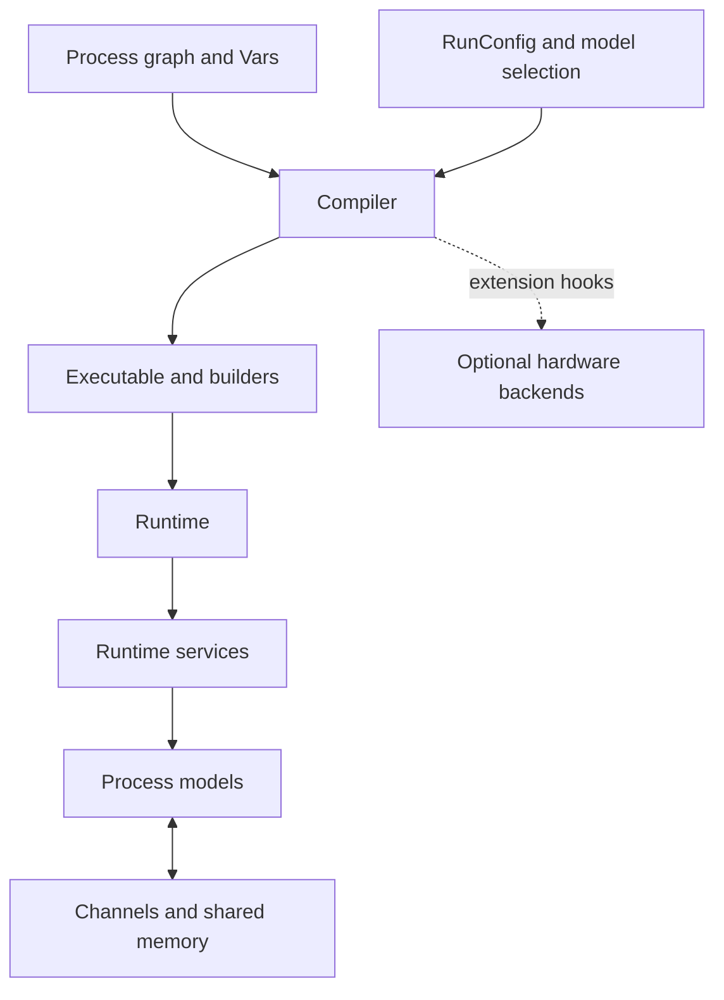

# Architecture

The inherited architecture separates graph declaration, model selection, compilation, and execution. The first LavaLM maintenance batch preserves those boundaries and the `lava.*` namespace.

## Declaration and state

`AbstractProcess` owns named port and variable collections. `InPort` and `OutPort` express message connectivity; `RefPort` and `VarPort` express reference access. `Var` captures shape and initialization, then delegates runtime access when the process is live. The new collection iterator snapshots membership per traversal so nested loops and partial traversal are independent.

Source: [process API](https://github.com/DarbotLM/LavaLM/blob/main/src/lava/magma/core/process/process.py), [ports](https://github.com/DarbotLM/LavaLM/blob/main/src/lava/magma/core/process/ports/ports.py), and [variables](https://github.com/DarbotLM/LavaLM/blob/main/src/lava/magma/core/process/variable.py).

## Models and protocols

A Process describes an interface; a ProcessModel implements behavior. Decorators connect models to processes, required resources, and selection tags. Python Loihi models follow protocol phases, including spiking and management activity. Async models have different scheduling semantics. A RunConfig selects a model implementation and assigns synchronization domains.

## Compilation

The compiler discovers connected processes, selects models, expands hierarchical subprocess models, creates builders and channels, and produces an Executable. Graph flattening now uses an explicit iterator stack; broader traversal determinism and convergence bounds remain [compiler specifications](engineering/chunks/04-compiler-and-backend-selection.md).

Execution graph nodes describe computation and connectivity. They are not yet typed semantic entities, facts, or provenance-bearing knowledge-graph records.

## Runtime and transport

Runtime builds the message infrastructure, channels, processes, and runtime services, then starts ports and schedules work. The multiprocessing backend uses actors and shared memory. The public lifecycle includes start, pause, wait, and stop. Current limitations include import-time start-method policy, partial-start cleanup, and waits without deadlines; these are tracked independently of the small context-manager binding fix.

## Where the future layers fit

Semantic codecs should translate versioned records into numerical representations consumed by process graphs. Classifier orchestration should call a stable runtime boundary. An agent adapter should translate session operations into that boundary, with explicit cancellation and result schemas. Graph storage and 3D rendering should consume semantic IDs and provenance independently of simulation memory layouts. These are proposed boundaries, not implemented modules.

Use the [139-module index](engineering/module-index.md) and [12 subsystem reviews](engineering/overview.md) to navigate the inherited implementation.
